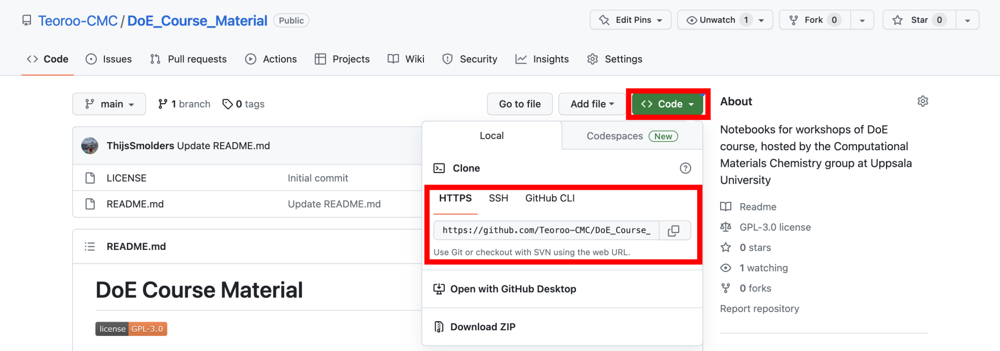

# DoE Course Material
[](https://opensource.org/licenses/LGPL-3.0)

Notebooks for workshops of DoE course, hosted by the Computational Materials Chemistry group at Uppsala University. 

## Only for Windows users
Open a Powershell terminal and run the following command:
```
wsl --install
```
after restarting your computer, this should allow you to use very useful navigation commands, such as cd, ls, mv, and many others that might be used throughout the remainder of this course.

## Git basics
Git is a version control system that helps you keep track of changes made to files in a project. Think of it as a tool that allows you to save different versions of your work, so you can easily go back and forth between them.

When you work on a project, Git provides several commands to manage your changes effectively:
* **git add**: This command is used to tell Git to start tracking changes in a specific file. It's like placing a file in a "staging area" where Git will take note of any modifications you make to it.
* **git commit**: After using git add, you need to commit your changes. A commit is like taking a snapshot of your project at a particular moment. It records all the changes you've added to the staging area, along with a descriptive message explaining what you did.
git push: When you're ready to share your work with others or back it up on a remote server, you use git push. This command sends your local commits to a remote repository, making them accessible to others and keeping your project synchronized.
* **git pull**: If others have made changes to the remote repository, you can use git pull to fetch those changes and merge them with your local version. It ensures that you have the latest updates before you continue working on your project.

* **git fetch**: Similar to git pull, git fetch also retrieves changes from the remote repository. However, it doesn't automatically merge them with your local version. Instead, it updates your local references to the remote branches, allowing you to review the changes and decide how to integrate them.

* **git fork**: Forking is a feature commonly used in open-source projects. It creates a personal copy of a repository, allowing you to freely experiment and make changes without affecting the original project. Forking is often used as a starting point for contributing to a project by making your changes and later proposing them to be merged back into the original repository.

Remember, these are just basic descriptions of the commands, and there is much more to learn about Git and its capabilities. But understanding these fundamental commands will give you a solid foundation to start using Git effectively in your projects.

## Access the material
### Fork the parent repo and then make a local clone
Fork the parent repo on Github to get your own copy of the repo.


Then get your own (forked) copy of the repo on your own machine using git clone:
```
git clone https://github.com/YOUR_USERNAME/DoE_Course_Material.git
```


